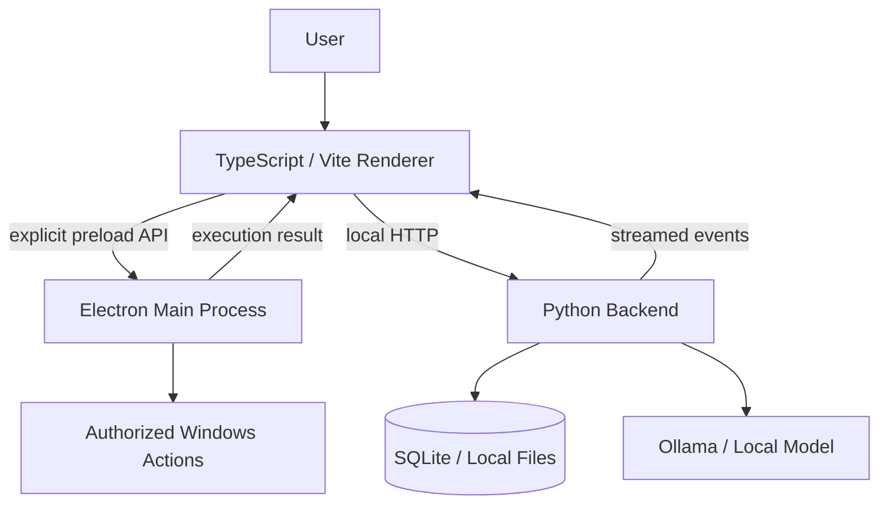
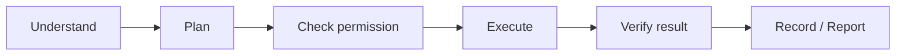

# Noa

[](https://github.com/PHenriquen/Noa/actions/workflows/ci.yml)

**Local desktop software for Windows focused on privacy, controlled automation and reliable system integration.**

Noa is a personal software engineering project that combines a TypeScript/Electron desktop interface, a Python backend, local persistence and optional local AI models.

I started it because I wanted to answer a practical question: **how useful can a desktop assistant become without giving a language model unrestricted access to the operating system?**

That question ended up shaping the project more than the model itself. Most of the engineering work is around process boundaries, permissions, native integration, persistence, failure handling and keeping several local components coordinated.

> **Status:** v1.0.2 — active development. The main local flows work on my development environment, but I do not consider the project production-ready yet.

## What I built

I built Noa as a desktop application rather than a chat page connected to a model API. The parts I spend most of my time on are the boundaries between the UI, Electron, the Python core and Windows.

Selected implementation paths:

- [`src/main.ts`](src/main.ts) — composition root for the TypeScript renderer;
- [`src/app/`](src/app/) — chat, audio, speech, applications, system state and UI controllers;
- [`desktop/main.cjs`](desktop/main.cjs) — Electron lifecycle, windows, tray, native actions and IPC handlers;
- [`desktop/preload.cjs`](desktop/preload.cjs) — the explicit renderer/native bridge;
- [`backend/app.py`](backend/app.py) — local services for model access, memory, documents and voice;
- [`backend/server.py`](backend/server.py) — local HTTP boundary;
- [`backend/security.py`](backend/security.py) — scoped authorization and an experimental tamper-evident audit trail;
- [`tests/`](tests/) and [`backend/tests/`](backend/tests/) — architecture, migration, app-resolution and security behavior checks.

The repository still contains some `TRACE` identifiers from the project's previous name. Instead of replacing them globally, I started a compatibility migration: new renderer code can use `noaNative` and `AssistantState`, while the old bridge/type names remain as temporary aliases. That lets me refactor without breaking packaging or persisted local data in one large rename.

## What Noa does today

- streams conversations through a local backend;
- stores conversation history in SQLite;
- supports local models through Ollama;
- reads authorized text, code, PDF, DOCX and image files;
- supports microphone input, wake-word experiments and local speech output;
- opens approved applications and runs predefined local routines;
- exports responses to TXT, PDF and DOCX;
- packages as a Windows desktop application;
- runs automated TypeScript, architecture and backend security checks in CI.

## Architecture



I separated the interface, native desktop integration and backend services because they fail in different ways and should not share the same privileges. The renderer does not receive direct Node.js, filesystem or shell access.

For a native action, the direction I am implementing is:



More detail: [`docs/ARCHITECTURE.md`](docs/ARCHITECTURE.md) and [`docs/decisions/`](docs/decisions/).

## Engineering challenges I ran into

### Preventing the renderer from becoming privileged by accident

Electron makes it easy to expose too much. I keep native operations behind preload methods and IPC handlers instead of giving renderer code direct access to Node.js APIs. That makes the permission surface visible and testable.

### Knowing whether an action actually happened

A model can say that an application opened even when the executor failed. I therefore treat native execution results separately from generated text. The long-term action pipeline is built around permission checks, deterministic executors and verification before reporting success.

### Voice state getting out of sync

Wake detection, microphone capture, transcription, speech playback and interruption can compete for the same audio state. I moved the renderer toward explicit state and controller boundaries rather than letting each feature start listeners independently.

### Renaming a project without breaking local users

Noa evolved from an earlier TRACE prototype. Some internal identifiers affect IPC, application data and packaging. I chose a compatibility migration instead of a global search-and-replace. The current `noaNative` / `traceNative` bridge alias is one small example of that approach.

## Engineering decisions

I keep short ADRs for decisions that affect multiple modules:

- [`ADR 001 — local-first data`](docs/decisions/001-local-first-data.md)
- [`ADR 002 — Electron/Python boundary`](docs/decisions/002-electron-python-boundary.md)
- [`ADR 003 — controlled native actions`](docs/decisions/003-controlled-native-actions.md)

The point of these notes is not to make the architecture look formal. I use them so I can remember *why* I made a trade-off when I revisit the code later.

## Tests based on failure modes

I prefer tests that protect behavior I could realistically break while changing the project.

Examples now in the repository:

- a resource outside an allowed root must be rejected;
- an unknown action must not pass the security policy;
- higher-risk actions can require confirmation;
- tampering with an audit record must invalidate verification;
- the new `noaNative` bridge must coexist with the legacy alias during migration;
- TypeScript modules and desktop/backend entry points have size/architecture guardrails.

Run the same validation used by CI:

```powershell
npm ci
npm run check
npm run build
```

## Tech stack

| Area | Technologies |
|---|---|
| Desktop | Electron, Electron Builder |
| Frontend | TypeScript, Vite, HTML, CSS |
| Backend | Python 3.13 |
| Data | SQLite |
| Local AI | Ollama / Qwen |
| Voice | Whisper.cpp, Piper, Windows speech APIs |
| Quality | Node Test Runner, Python `unittest`, TypeScript checks, GitHub Actions |
| Experimental | small local ML classifier, C++ audio/concurrency lab |

The ML and C++ modules are experiments, not requirements for the main runtime. I keep them isolated until I can show that the extra complexity solves a real problem.

## Repository structure

```text
NOA/
├── backend/       # Python services, local API and behavior tests
├── desktop/       # Electron main process, preload and native integration
├── src/           # TypeScript renderer and controllers
├── tests/         # Node architecture/integration guardrails
├── scripts/       # setup, diagnostics, measurements, backup and packaging
├── native/        # native assets and isolated experiments
├── docs/          # architecture, ADRs, product notes and demo plan
└── .github/       # CI workflows
```

## What I learned while building it

The project started more centralized than it is today. That made early iteration fast, but it also made bugs harder to isolate as voice, document handling and native actions grew.

A few lessons that changed the code:

- a desktop assistant needs an execution model, not only a conversation model;
- explicit process boundaries are worth the extra plumbing when different parts have different privileges;
- a failure path is part of the product and should be demonstrable;
- large renames are not harmless when identifiers leak into persisted data and packaging;
- adding another model or framework is usually less useful than making an existing boundary easier to test.

The biggest remaining technical debt is [`backend/app.py`](backend/app.py): it still owns more responsibilities than I want. I am separating model-provider, memory and document behavior gradually, with tests around each boundary instead of moving code only to make the folder tree look cleaner.

## Reproducible measurements

I do not publish performance numbers that I have not measured on a known machine. The repository includes a small Windows measurement script that times type checking, Node tests, backend tests and the production build, and reports the built `dist` size with environment information:

```powershell
npm run metrics:portfolio
```

This is intentionally about reproducibility rather than advertising a single number from my development PC.

## Demo

The repository has a short, reproducible demo plan in [`docs/PORTFOLIO_DEMO.md`](docs/PORTFOLIO_DEMO.md). The sequence is designed to show a streamed response, a controlled native action, persisted local state and a visible failure path.

I will only embed a GIF/video here when it is recorded from a clean run that matches a repository commit. I prefer having no demo asset over showing a polished recording that cannot be reproduced from the code.

## Running locally

### Requirements

- Windows 10 or 11
- Node.js 22+
- npm 10+
- Python 3.13 recommended
- Git
- Ollama for the default local model provider

### Install and validate

```powershell
npm ci
npm run check
npm run build
```

### Start the desktop app

```powershell
npm run desktop
```

### Start only the Python core

```powershell
python -m backend.launcher
```

## Current limitations

- voice activation still depends heavily on microphone quality and environment calibration;
- some optional local components require an initial download;
- the application still needs broader validation on clean Windows installations;
- code signing and automatic updates are not configured for public distribution;
- the `TRACE` compatibility layer still exists in internal identifiers;
- the policy/audit module is not yet in the critical execution path for every native action.

## What I am improving next

- finish the gradual `TRACE` -> Noa migration with compatibility tests;
- integrate the permission/action policy into more execution paths;
- improve voice-state coordination and interruption;
- split model-provider, memory and document responsibilities out of `backend/app.py`;
- add path-traversal and native-action abuse tests;
- validate installation and packaging on a clean Windows environment;
- record the demo sequence against a tagged commit.

I track concrete work as GitHub issues instead of turning the README into a roadmap full of promises.

## Documentation

- [`ARCHITECTURE.md`](docs/ARCHITECTURE.md) — system boundaries and technical decisions
- [`decisions/`](docs/decisions/) — short architecture decision records
- [`DEVELOPMENT.md`](docs/DEVELOPMENT.md) — local development notes
- [`PORTFOLIO_DEMO.md`](docs/PORTFOLIO_DEMO.md) — reproducible demo sequence
- [`PRODUCT.md`](docs/PRODUCT.md) — product direction
- [`ENGINEERING_LABS.md`](docs/ENGINEERING_LABS.md) — isolated technical experiments
- [`BACKUP_AND_RECOVERY.md`](docs/BACKUP_AND_RECOVERY.md) — local data and recovery strategy

## License

The repository is currently `UNLICENSED`. A public license will be selected before opening the project for external contributions or broader distribution.
